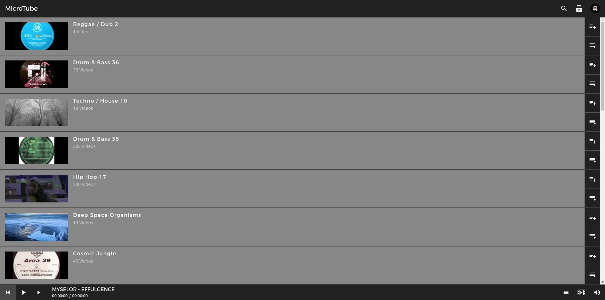

## Youtube Lite

### Installation

1. run npm install
2. fill .env file  
3. register urls in Google Developer Console:  
⋅⋅localhost:3000  
⋅⋅localhost:3000/auth/callback  

### Start app

npm run build && npm run start
